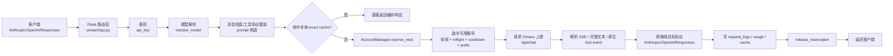
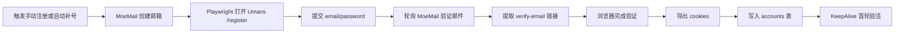

# umans2api

把 `https://app.umans.ai/api/chat` 包成一个本地可控的 API 网关。

它现在不只是最初的“单文件 Flask 代理”，而是一套完整的运行时：

- 对外兼容 **Anthropic `/v1/messages`**
- 对外兼容 **OpenAI `/v1/chat/completions`**
- 对外兼容 **OpenAI `/v1/responses`**
- 内置 **管理面板**、**多账号轮询**、**请求日志**、**精确响应缓存**
- 支持 **KeepAlive / 自动重登 / MoeMail 自动注册补号**

> 入口文件名是 **`umasn2api.py`**，注意仓库里就是这个拼写。

---

## 1. 项目定位

这个项目的核心目标，是把 Umans Web 端登录态（cookie）转换成稳定的 API 服务，并补齐生产可运维能力。

### 1.1 它解决的问题

1. Claude Code / Anthropic 客户端只能打 Anthropic 风格接口
2. 一些 OpenAI 生态客户端只能打 OpenAI 风格接口
3. Umans 原生只暴露站内聊天接口 `/api/chat`
4. 单账号 cookie 容易过期，且不适合并发/轮询/面板化运维

所以这里做了三层转换：

1. **协议转换**：Anthropic / OpenAI / Responses → Umans `/api/chat`
2. **账号调度**：单 cookie → SQLite 多账号池
3. **运行增强**：KeepAlive / Auto Relogin / Auto Register / Logs / Cache / Admin UI

---

## 2. 当前代码结构

```text
.
├── umasn2api.py                 # 主 Flask 应用与所有对外 API 路由
├── config.json                  # 文件级基础配置（启动时读取）
├── umans2api/
│   ├── account_manager.py       # 账号池、轮询、故障降级、cookie 合并
│   ├── auto_register.py         # 自动注册/自动补号任务编排
│   ├── browser_auth.py          # Playwright 注册/登录/导出 cookies
│   ├── db.py                    # SQLite 初始化、日志、配置、缓存
│   ├── keepalive.py             # Session 探测、刷新、自动重登
│   └── moemail.py               # MoeMail 邮箱创建与验邮轮询
├── templates/index.html         # 管理面板前端
├── tests/                       # 最小回归测试
├── Dockerfile                   # 容器镜像
├── docker-compose.yml           # 本地/服务器容器启动
└── data/
    ├── umans2api.db             # 运行态真相源
    └── *.png / *.lock           # 截图、后台锁等运行产物
```

### 2.1 运行态真相源

现在这个项目的运行态真相，已经不再是 `config.json` 里的单个 `cookies`。

真正的运行时状态主要在 SQLite：

- `data/umans2api.db.accounts`
- `data/umans2api.db.configs`
- `data/umans2api.db.request_logs`
- `data/umans2api.db.response_cache`

`config.json` 更像：

- 初始引导配置
- 默认值来源
- legacy 单账号导入来源

只有当数据库里还没有账号时，启动阶段才会把 `config.json.cookies` 自动导入成 `legacy-default` 账号。

---

## 3. 依赖与启动

### 3.1 本地直接启动

这个仓库目前没有 `requirements.txt`，按代码与 Dockerfile 推断，最小依赖是：

```bash
python3 -m venv .venv
source .venv/bin/activate
pip install flask requests playwright gunicorn
python -m playwright install chromium
python3 umasn2api.py
```

默认监听：

- `http://127.0.0.1:8787`（代码默认）
- 当前仓库 `config.json` 已把 `host` 设为 `0.0.0.0`，因此实际更像 `0.0.0.0:8787`

### 3.2 Docker 启动

```bash
docker compose up -d --build
```

默认映射：

- 容器内：`8787`
- 宿主机：`${HOST_PORT:-18787}`

即默认访问：

- `http://127.0.0.1:18787`

### 3.3 Gunicorn 多 worker 说明

容器默认命令：

```bash
gunicorn -w 2 --threads 8 -b 0.0.0.0:8787 --timeout 300 umasn2api:app
```

项目内部有一个后台锁：

- `/tmp/umans2api.background.lock`

它的作用是：

- 多 worker 场景下，只允许 **1 个进程** 启动后台线程
- 避免 KeepAlive、自动补号、模型目录刷新被重复执行

---

## 4. 配置说明

### 4.1 核心接入配置

- `host` / `port`
  - 服务监听地址
- `api_key`
  - 对外 API 鉴权
  - `/v1/messages`、`/v1/chat/completions`、`/v1/responses` 都用它
- `admin_token`
  - 管理面板与 `/api/*` 管理接口鉴权
- `upstream_url`
  - 当前固定上游：`https://app.umans.ai/api/chat`
- `default_model`
  - 默认映射到 Umans 上游模型
- `available_models`
  - 对外暴露的模型列表基线
- `claude_model_map`
  - Claude 模型名到 Umans 模型名的精确映射
- `claude_keyword_map`
  - 当请求模型名里含 `opus/sonnet/haiku` 时的关键字映射

### 4.2 调度与容灾配置

- `fail_threshold`
  - 连续失败阈值
- `max_inflight`
  - 单账号最大并发占用数
- `cooldown_seconds`
  - 连续失败后进入 cooling 的冷却时间

### 4.3 KeepAlive / 自动重登配置

- `keepalive_interval_seconds`
  - 后台巡检周期
- `keepalive_expiring_minutes`
  - session 过期前多少分钟开始视为需要刷新
- `keepalive_chat_fallback_enabled`
  - 首页刷新不够时，是否退化到发一个最小 `/api/chat` SSE 请求刷新 session
- `AUTO_RELOGIN_ENABLED`
  - session 明显失效时，是否自动用账号密码重新登录并更新 cookies

### 4.4 自动注册 / MoeMail 配置

- `AUTO_REGISTER_ENABLED`
  - 低水位自动补号开关
- `AUTO_REGISTER_MIN_ACTIVE`
  - 活跃账号低于该阈值时触发补号
- `AUTO_REGISTER_BATCH`
  - 每次自动补号数量
- `AUTO_REGISTER_MAX_WORKERS`
  - 自动补号 worker 数
- `AUTO_REGISTER_PASSWORD`
  - 固定注册密码；为空则自动生成
- `AUTO_REGISTER_BROWSER_MODE_MANUAL`
  - 手动注册使用 `visible` / `headless`
- `AUTO_REGISTER_BROWSER_MODE_BACKGROUND`
  - 自动补号使用 `visible` / `headless`
- `REGISTER_PROXY`
  - 浏览器注册 / 自动重登代理
- `MAIL_USE_PROXY`
  - MoeMail 请求是否走同一个代理
- `MAIL_PROVIDER_DEFAULT`
  - 当前实现要求为 `moemail`
- `MOEMAIL_API_KEY` / `MOEMAIL_API_BASE` / `MOEMAIL_CHANNELS_JSON`
  - MoeMail 单通道 / 多通道配置

### 4.5 响应缓存配置

- `RESPONSE_CACHE_ENABLED`
  - 是否开启精确响应缓存
- `RESPONSE_CACHE_TTL_SECONDS`
  - 缓存 TTL
- `RESPONSE_CACHE_MAX_ENTRIES`
  - 最大缓存条数

### 4.6 配置修改优先级

运行时优先级是：

1. `config.json`
2. SQLite `configs` 覆盖项
3. `reload_runtime_config()` 重新加载到内存

也就是说：

- 面板里改的配置，最终写入的是 SQLite `configs`
- 文件里的 `config.json` 仍然保留“默认值/初始值”角色

> 建议：不要把真实 cookies、真实 admin token、真实 MoeMail key 提交进仓库。

另外，`cookies` 里的值必须能被 `latin-1` 编码。

- 中文占位词不会被当成“无害注释”
- 它会在 requests 组 Cookie 头之前就触发 `UnicodeEncodeError`
- 最终表现成代理请求在真正访问上游之前就失败

---

## 5. 对外接口与兼容面

### 5.1 用户侧页面

- `GET /`
  - 管理面板 UI
- `GET /health`
  - 健康检查 + 当前运行态摘要

### 5.2 管理接口（Admin）

需要 `admin_token` 登录，或直接带 `Authorization: Bearer <admin_token>`。

- `POST /api/login`
- `GET /api/auth/check`
- `GET /api/runtime`
- `GET /api/stats`
- `GET /api/usage`
- `GET /api/logs`
- `GET /api/logs/<log_id>`
- `GET /api/accounts`
- `POST /api/accounts`
- `GET /api/accounts/<account_id>`
- `PUT /api/accounts/<account_id>`
- `DELETE /api/accounts/<account_id>`
- `POST /api/accounts/batch-action`
- `POST /api/accounts/<account_id>/test-session`
- `POST /api/accounts/<account_id>/keepalive`
- `POST /api/accounts/<account_id>/relogin`
- `POST /api/accounts/<account_id>/enable`
- `POST /api/accounts/<account_id>/disable`
- `POST /api/keepalive/run`
- `GET /api/auto-register/config`
- `POST /api/auto-register/start`
- `POST /api/auto-register/stop`
- `GET /api/auto-register/stream`
- `GET /api/config`
- `PUT /api/config`

### 5.3 代理接口（供模型客户端接入）

- `GET /v1/models`
- `POST /v1/messages/count_tokens`
- `POST /v1/messages`
- `POST /v1/chat/completions`
- `POST /v1/responses`

---

## 6. 请求全链路

### 6.1 主链路总览



### 6.2 详细步骤

#### 第 1 步：鉴权

- `/v1/*` 用 `api_key`
- 支持：
  - `x-api-key`
  - `Authorization: Bearer <api_key>`

#### 第 2 步：模型解析

模型解析顺序：

1. 命中 `available_models`
2. 命中上游短别名（如 `glm-5.1` → `umans-glm-5.1`）
3. 命中 `claude_model_map`
4. 命中 `claude_keyword_map` 关键字
5. 回退 `default_model`

这一步同时会尝试刷新 Umans 上游模型目录，并对比：

- 配置里有哪些模型
- 上游实际有哪些模型
- 哪些 Claude 映射已经指向失效模型

#### 第 3 步：协议转成 Umans Prompt

项目不是直接把 Anthropic/OpenAI JSON 原样转发到 Umans。

而是做了一层“拍扁”：

- 把历史消息整理成一段文本 prompt
- system / developer / tool_result 都会被拼进去
- tool 定义会额外拼成系统说明
- 开启 reasoning/thinking 时，会给模型注入 `<thinking>...</thinking>` 约定

#### 第 4 步：Exact Response Cache

命中条件：

- `RESPONSE_CACHE_ENABLED = true`
- 请求路径在：
  - `/v1/messages`
  - `/v1/chat/completions`
  - `/v1/responses`
- 当前请求 **不带工具调用**

缓存 key 由这些字段共同决定：

- 当前调用方鉴权 scope（基于 API key 哈希）
- 请求路径
- 上游模型
- prompt hash

所以它是“同调用方 + 同模型 + 同 prompt”的精确命中缓存，不是模糊缓存。

#### 第 5 步：账号选择

`AccountManager.reserve_next(upstream_model)` 会过滤账号：

- `enabled = 1`
- `status != disabled`
- 不在 `exclude_ids`
- `allowed_model_prefix` 支持当前模型
- 不在 cooldown 窗口
- `failures < fail_threshold`
- `inflight_count < max_inflight`

过滤后再做 round-robin，选中账号后：

- `inflight_count + 1`
- 更新 `last_selected_at`

#### 第 6 步：上游请求

统一打到：

- `POST https://app.umans.ai/api/chat`

请求特征：

- 带账号 cookies
- `stream=True`
- `allow_redirects=False`

`allow_redirects=False` 很关键：

- session 失效时，会直接暴露 302/307 登录跳转
- 不会被 requests 自动跳过去，导致表面看起来像 405/HTML 错页

#### 第 7 步：上游 SSE 解析

项目会解析 Umans SSE 里的：

- `text-delta`
- `finish`
- 原生 tool 相关事件：
  - `tool-input-start`
  - `tool-input-delta`
  - `tool-input-available`

如果上游没有原生 tool 事件，就会回退到文本解析：

- 识别 `<tool_call>{...}</tool_call>`
- 识别裸 JSON `{"name": ..., "input": ...}`
- 再拼回 Anthropic / OpenAI 所需的工具调用格式

#### 第 8 步：协议回包

- `/v1/messages`
  - 输出 Anthropic 兼容结构
  - 支持 `tool_use`
  - 支持 `thinking`
- `/v1/chat/completions`
  - 输出 OpenAI Chat Completions 兼容结构
  - 支持 `tool_calls`
  - 支持 `reasoning_content`
- `/v1/responses`
  - 输出 OpenAI Responses 兼容结构
  - 支持 `reasoning`、`function_call`
  - `previous_response_id` 的上下文状态保存在进程内内存里

#### 第 9 步：日志、缓存、释放占用

请求结束后会：

- `mark_ok()` 或 `mark_fail()`
- 写 `request_logs`
- 视情况写 `response_cache`
- `release_reservation()` 归还账号 inflight 占用

---

## 7. 管理面板全链路

### 7.1 管理链路

```mermaid
flowchart LR
    A[浏览器打开 /] --> B[templates/index.html]
    B --> C[/api/login]
    C --> D[Flask Session 或 Bearer admin_token]
    D --> E[/api/runtime /api/stats /api/accounts /api/logs /api/config]
    E --> F[SQLite accounts/configs/request_logs/response_cache]
```

### 7.2 面板能做什么

1. 登录 admin
2. 查看当前 runtime 信息
3. 查看账号池摘要
4. 增删改账号
5. 单账号验活 / keepalive / relogin / enable / disable
6. 批量 enable / disable / delete / keepalive / test-session
7. 查看 usage / cache / 请求日志
8. 修改运行参数
9. 启动/停止自动注册任务，并通过 SSE 观察进度

---

## 8. KeepAlive / 自动重登链路

### 8.1 KeepAlive 逻辑

`KeepAliveService.run_once()` 会遍历启用账号，逐个执行：

1. `GET /api/auth/session` 检查 session
2. 如果快过期或异常，则 `refresh_account()`
3. `refresh_account()` 先做 `GET /`
4. 如果刷新仍不够，再退化到 `_chat_refresh()`：
   - 发一个最小 `POST /api/chat`
   - 只要读到首个 SSE 事件就收手
5. 刷新成功后把响应里的 cookies 合并回 DB

### 8.2 自动重登逻辑

当 `check_account()` 认为这是明显 auth 失效时：

- 302 / 307 / 308
- 401
- 某些带 `login/session/auth/callbackurl` 文本的 403

如果 `AUTO_RELOGIN_ENABLED = true`，则继续：

1. 用 DB 里保存的 `email + password`
2. Playwright 打开 `/login`
3. 登录成功后导出 cookies
4. 更新账号 cookies
5. 再拉一次 `/api/auth/session`

### 8.3 为什么不是只打 `/api/auth/session`

因为代码里已经把这个接口当作：

- **状态探针**，不是完整刷新动作

真正稳的刷新顺序是：

1. 先探 session
2. 再刷新首页
3. 必要时再发最小 chat SSE

---

## 9. 自动注册 / 自动补号链路

### 9.1 总流程



### 9.2 手动注册

- `POST /api/auto-register/start`
- `GET /api/auto-register/stream`
- `POST /api/auto-register/stop`

特点：

- 支持 `visible` / `headless`
- `visible` 模式强制单 worker
- 任务日志和结果通过 SSE 推送

### 9.3 自动补号

后台线程会持续检查：

- `AUTO_REGISTER_ENABLED = true`
- 当前没有手动注册任务在跑
- 当前不在后台补号锁里
- `active_accounts < AUTO_REGISTER_MIN_ACTIVE`

满足后会按：

- `AUTO_REGISTER_BATCH`
- `AUTO_REGISTER_MAX_WORKERS`

自动补足账号。

### 9.4 自动注册对依赖的要求

自动注册要同时满足：

1. Playwright 可用
2. MoeMail 已正确配置
3. `MAIL_PROVIDER_DEFAULT = moemail`

缺一项都不能启动。

---

## 10. 数据库设计

### 10.1 `accounts`

账号池主表，保存：

- 账号身份：`name / email`
- 登录态：`cookies_json`
- 模型权限：`allowed_model_prefix`
- session 信息：`plan / session_expires_at`
- 调度状态：`enabled / status / failures / inflight_count / cooldown_until`
- 运维状态：`last_keepalive_at / last_session_check_at / last_chat_ok_at / last_selected_at / last_error`
- 自动化辅助：`password / register_source / auth_mode / last_registered_at / last_relogin_at / last_relogin_error`

### 10.2 `configs`

运行时覆盖配置表。

作用：

- 保持面板改动持久化
- 不直接回写 `config.json`

### 10.3 `request_logs`

每次代理请求都会记日志，包含：

- path / api_format / stream
- client_model / upstream_model
- account_id / account_name
- ok / status_code / duration_ms / error
- finish_reason / response_id / tool_count / reasoning_chars
- input / output / total / reasoning tokens
- cache_hit / cache_read_input_tokens / cache_creation_input_tokens
- `detail_json`
  - 请求预览
  - 响应预览
  - reasoning 预览
  - tool_calls
  - timeline phases

### 10.4 `response_cache`

本地 exact cache 表，保存：

- cache_key
- scope_key
- api_format
- model
- prompt_hash
- payload_json
- hit_count
- created_at / last_hit_at / expires_at

---

## 11. 典型接入方式

### 11.1 Anthropic `/v1/messages`

```bash
curl http://127.0.0.1:8787/v1/messages \
  -H 'Content-Type: application/json' \
  -H 'x-api-key: YOUR_API_KEY' \
  -d '{
    "model": "claude-sonnet-4-6",
    "max_tokens": 128,
    "messages": [
      {"role": "user", "content": "reply exactly pong"}
    ]
  }'
```

### 11.2 OpenAI `/v1/chat/completions`

```bash
curl http://127.0.0.1:8787/v1/chat/completions \
  -H 'Content-Type: application/json' \
  -H 'Authorization: Bearer YOUR_API_KEY' \
  -d '{
    "model": "umans-coding-model",
    "messages": [
      {"role": "user", "content": "reply exactly pong"}
    ]
  }'
```

### 11.3 OpenAI `/v1/responses`

```bash
curl http://127.0.0.1:8787/v1/responses \
  -H 'Content-Type: application/json' \
  -H 'Authorization: Bearer YOUR_API_KEY' \
  -d '{
    "model": "umans-coding-model",
    "input": "reply exactly pong"
  }'
```

### 11.4 管理接口登录

```bash
curl http://127.0.0.1:8787/api/login \
  -H 'Content-Type: application/json' \
  -c /tmp/umans2api-admin.cookies \
  -d '{"token":"YOUR_ADMIN_TOKEN"}'
```

登录后可以继续带 cookie 请求：

```bash
curl http://127.0.0.1:8787/api/runtime \
  -b /tmp/umans2api-admin.cookies
```

---

## 12. 常见问题与排障顺序

### 12.1 `invalid api key`

先看两层鉴权是不是混了：

- `/v1/*` 要的是 `api_key`
- `/api/*` 要的是 `admin_token`

### 12.2 上游返回 302 / 307 / 403，像登录失效

优先判断 cookie/session 问题，不要先怀疑模型。

这个项目已经故意把上游请求设成 `allow_redirects=False`，就是为了让登录跳转直接暴露出来。

如果你刚改过 `config.json.cookies`，也要先确认 cookie 值本身不是中文占位词或其他非 `latin-1` 内容。

### 12.3 `model-not-allowed` 且 `allowedPrefix = "umans-"`

这通常不是 cookie 坏了，而是：

- 当前账号套餐只允许 `umans-` 前缀模型

应该先改：

- `default_model`
- `available_models`
- `claude_model_map`
- `claude_keyword_map`

而不是继续深挖鉴权。

### 12.4 `no account available`

通常从这几个方向排：

1. 所有账号都被禁用
2. 账号在 cooling
3. `inflight_count` 已达上限
4. `allowed_model_prefix` 不匹配当前请求模型
5. DB 里根本没有有效账号

### 12.5 自动注册起不来

先看 `/api/auto-register/config`：

- Playwright 是否就绪
- MoeMail 是否配置完成
- `MAIL_PROVIDER_DEFAULT` 是否为 `moemail`

### 12.6 Responses API 续上下文丢失

`previous_response_id` 的历史状态当前保存在 **进程内内存**，不是 SQLite。

所以：

- 进程重启后，Responses 的内存态续聊会丢
- Gunicorn 多进程也不适合把它当强一致会话存储

### 12.7 config.json 改了但运行态没生效

因为当前项目存在两套配置来源：

- `config.json`
- SQLite `configs`

如果你是从面板里改过配置，最终生效的通常是 SQLite 覆盖项。

---

## 13. 已验证内容（本次 README 更新时）

本次基于当前仓库代码和本地环境，已做过的最小验证：

1. 单元/路由测试

```bash
python3 -m unittest discover -s tests -v
```

结果：**12/12 通过**。

2. 轻量 smoke

- `GET /health` → `200`
- 带正确 `api_key` 请求 `GET /v1/models` → `200`
- 当前本地 smoke 返回模型数：`13`

> 上面这组 smoke 只证明“当前代码能启动、路由能回、模型列表能取到”，不等于你本机的 cookies、MoeMail、自动注册一定已经配置完成。

---

## 14. 最重要的结论

如果你后续继续维护这个项目，最应该记住的是这 6 点：

1. **真正的上游只有一个：`app.umans.ai/api/chat`**
2. **真正的运行态真相源是 SQLite，不再只是 `config.json`**
3. **请求主链路的关键节点是：鉴权 → 模型解析 → prompt 拍扁 → cache → 账号轮询 → 上游 SSE → 协议回包 → 日志/cache**
4. **KeepAlive 不是只打 `/api/auth/session`，必要时要退化到最小 chat 刷新**
5. **自动注册链路是：MoeMail → Playwright 注册 → 验邮 → 导出 cookies → 入库 → 首轮验活**
6. **排障时先分清“cookie/session 问题”还是“模型权限问题”，别混着查**
